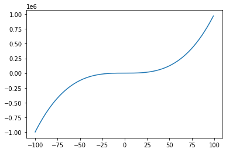

## Plotting (y) = x^3 with python

import the matplotlib package


```python
import matplotlib.pyplot as plt
```

assign values for the x coordinates and y coordinates


```python
x_cords = range(-100,100)
y_cords = [pow(x, 3) for x in x_cords]
```

plot the x & y coordinates


```python
plt.plot(x_cords, y_cords)
plt.show()
```


    

    

